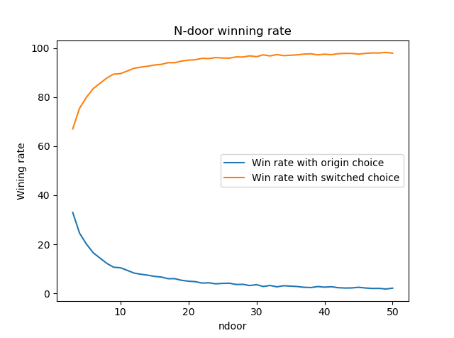

# This repo is used for cs109 Data Science Course from Harvard
## Link: http://cs109.github.io/2015/pages/videos.html 

## HW0 (N-door Monty Hall Problem):
* Description: https://github.com/cs109/2015lab1/blob/master/hw0.ipynb
* Code: hw0.py
* Result:
